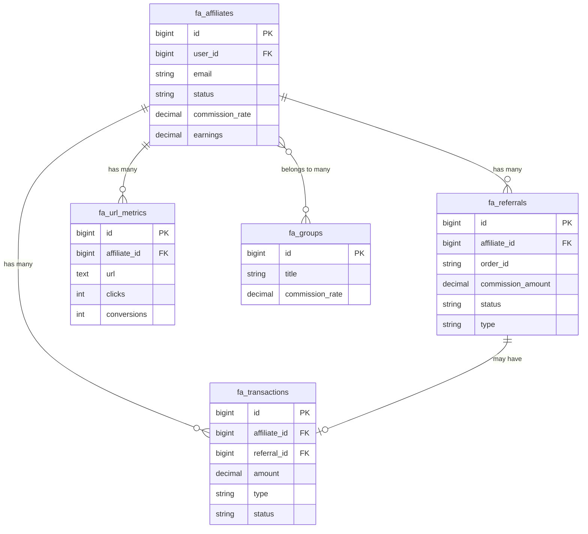

# Database Schema

FluentAffiliate Core Intermediate

Understanding FluentAffiliate's database structure is essential for effective development. This guide covers the complete database schema, table relationships, and data flow patterns.

## Overview

FluentAffiliate uses a normalized database structure with 5 core tables that handle all affiliate marketing operations. The schema is designed for performance, scalability, and data integrity.

### 🗄️ **Core Tables**

| Table | Purpose | Records |
|-------|---------|---------|
| `fa_affiliates` | Affiliate profiles and settings | Affiliate data |
| `fa_referrals` | Referral tracking and commissions | Conversion events |
| `fa_transactions` | Financial transactions and payouts | Payment records |
| `fa_groups` | Affiliate groups and tiers | Organization data |
| `fa_url_metrics` | URL tracking and analytics | Performance data |

## Table Structures

### 📊 **fa_affiliates**

The central table storing all affiliate information and settings.

```sql
CREATE TABLE `fa_affiliates` (
  `id` bigint(20) unsigned NOT NULL AUTO_INCREMENT,
  `user_id` bigint(20) unsigned NOT NULL,
  `first_name` varchar(255) DEFAULT NULL,
  `last_name` varchar(255) DEFAULT NULL,
  `email` varchar(255) NOT NULL,
  `payment_email` varchar(255) DEFAULT NULL,
  `status` varchar(50) DEFAULT 'pending',
  `commission_rate` decimal(8,2) DEFAULT NULL,
  `commission_type` varchar(50) DEFAULT 'percentage',
  `earnings` decimal(15,2) DEFAULT '0.00',
  `paid_earnings` decimal(15,2) DEFAULT '0.00',
  `unpaid_earnings` decimal(15,2) DEFAULT '0.00',
  `total_referrals` int(11) DEFAULT '0',
  `total_visits` int(11) DEFAULT '0',
  `conversion_rate` decimal(5,2) DEFAULT '0.00',
  `settings` longtext,
  `created_at` timestamp NULL DEFAULT NULL,
  `updated_at` timestamp NULL DEFAULT NULL,
  PRIMARY KEY (`id`),
  UNIQUE KEY `fa_affiliates_user_id_unique` (`user_id`),
  UNIQUE KEY `fa_affiliates_email_unique` (`email`),
  KEY `fa_affiliates_status_index` (`status`)
);
```

**Key Fields:**
- `user_id` - Links to WordPress users table
- `status` - pending, active, inactive, suspended
- `commission_rate` - Individual commission rate (overrides global)
- `commission_type` - percentage, fixed
- `earnings` - Total lifetime earnings
- `settings` - JSON data for custom configurations

### 💰 **fa_referrals**

Tracks all referral events and commission calculations.

```sql
CREATE TABLE `fa_referrals` (
  `id` bigint(20) unsigned NOT NULL AUTO_INCREMENT,
  `affiliate_id` bigint(20) unsigned NOT NULL,
  `customer_email` varchar(255) DEFAULT NULL,
  `order_id` varchar(255) DEFAULT NULL,
  `order_total` decimal(15,2) DEFAULT '0.00',
  `commission_amount` decimal(15,2) DEFAULT '0.00',
  `commission_rate` decimal(8,2) DEFAULT NULL,
  `commission_type` varchar(50) DEFAULT 'percentage',
  `currency` varchar(10) DEFAULT 'USD',
  `status` varchar(50) DEFAULT 'pending',
  `type` varchar(100) DEFAULT 'sale',
  `origin` varchar(100) DEFAULT NULL,
  `reference` varchar(255) DEFAULT NULL,
  `description` text,
  `meta` longtext,
  `created_at` timestamp NULL DEFAULT NULL,
  `updated_at` timestamp NULL DEFAULT NULL,
  PRIMARY KEY (`id`),
  KEY `fa_referrals_affiliate_id_index` (`affiliate_id`),
  KEY `fa_referrals_status_index` (`status`),
  KEY `fa_referrals_type_index` (`type`),
  KEY `fa_referrals_origin_index` (`origin`)
);
```

**Key Fields:**
- `affiliate_id` - Links to fa_affiliates table
- `order_id` - External order/transaction reference
- `commission_amount` - Calculated commission value
- `status` - pending, approved, rejected, paid
- `type` - sale, lead, click, custom
- `origin` - woocommerce, edd, fluentforms, etc.

### 🏦 **fa_transactions**

Financial transaction records for payouts and adjustments.

```sql
CREATE TABLE `fa_transactions` (
  `id` bigint(20) unsigned NOT NULL AUTO_INCREMENT,
  `affiliate_id` bigint(20) unsigned NOT NULL,
  `referral_id` bigint(20) unsigned DEFAULT NULL,
  `amount` decimal(15,2) NOT NULL,
  `currency` varchar(10) DEFAULT 'USD',
  `type` varchar(50) NOT NULL,
  `status` varchar(50) DEFAULT 'pending',
  `method` varchar(100) DEFAULT NULL,
  `reference` varchar(255) DEFAULT NULL,
  `description` text,
  `meta` longtext,
  `created_at` timestamp NULL DEFAULT NULL,
  `updated_at` timestamp NULL DEFAULT NULL,
  PRIMARY KEY (`id`),
  KEY `fa_transactions_affiliate_id_index` (`affiliate_id`),
  KEY `fa_transactions_referral_id_index` (`referral_id`),
  KEY `fa_transactions_type_index` (`type`),
  KEY `fa_transactions_status_index` (`status`)
);
```

**Key Fields:**
- `affiliate_id` - Links to fa_affiliates table
- `referral_id` - Links to fa_referrals table (optional)
- `type` - payout, adjustment, bonus, deduction
- `status` - pending, processing, paid, failed
- `method` - paypal, bank_transfer, manual, etc.

### 👥 **fa_groups**

Organize affiliates into groups with different settings.

```sql
CREATE TABLE `fa_groups` (
  `id` bigint(20) unsigned NOT NULL AUTO_INCREMENT,
  `title` varchar(255) NOT NULL,
  `slug` varchar(255) NOT NULL,
  `description` text,
  `commission_rate` decimal(8,2) DEFAULT NULL,
  `commission_type` varchar(50) DEFAULT 'percentage',
  `settings` longtext,
  `created_at` timestamp NULL DEFAULT NULL,
  `updated_at` timestamp NULL DEFAULT NULL,
  PRIMARY KEY (`id`),
  UNIQUE KEY `fa_groups_slug_unique` (`slug`)
);
```

### 📈 **fa_url_metrics**

Track URL performance and click analytics.

```sql
CREATE TABLE `fa_url_metrics` (
  `id` bigint(20) unsigned NOT NULL AUTO_INCREMENT,
  `affiliate_id` bigint(20) unsigned NOT NULL,
  `url` text NOT NULL,
  `clicks` int(11) DEFAULT '0',
  `conversions` int(11) DEFAULT '0',
  `conversion_rate` decimal(5,2) DEFAULT '0.00',
  `last_clicked` timestamp NULL DEFAULT NULL,
  `created_at` timestamp NULL DEFAULT NULL,
  `updated_at` timestamp NULL DEFAULT NULL,
  PRIMARY KEY (`id`),
  KEY `fa_url_metrics_affiliate_id_index` (`affiliate_id`)
);
```

## Relationships

### 🔗 **Table Relationships**



### 📋 **Relationship Details**

**One-to-Many Relationships:**
- `fa_affiliates` → `fa_referrals` (One affiliate has many referrals)
- `fa_affiliates` → `fa_transactions` (One affiliate has many transactions)
- `fa_affiliates` → `fa_url_metrics` (One affiliate has many URL metrics)

**Optional Relationships:**
- `fa_referrals` → `fa_transactions` (Referral may have associated transaction)

**Many-to-Many Relationships:**
- `fa_affiliates` ↔ `fa_groups` (Affiliates can belong to multiple groups)

## Data Flow

### 🔄 **Typical Data Flow**

1. **Affiliate Registration**
   ```
   WordPress User → fa_affiliates (pending status)
   ```

2. **Referral Tracking**
   ```
   Click Tracking → fa_url_metrics (increment clicks)
   Conversion → fa_referrals (create referral record)
   Commission Calculation → fa_affiliates (update earnings)
   ```

3. **Payout Processing**
   ```
   Approved Referrals → fa_transactions (create payout)
   Payment Processing → fa_transactions (update status)
   Earnings Update → fa_affiliates (update paid_earnings)
   ```

## Indexes and Performance

### 🚀 **Key Indexes**

**Primary Indexes:**
- All tables have auto-increment primary keys
- Unique constraints on critical fields (email, user_id)

**Performance Indexes:**
- `status` fields for filtering active/pending records
- `affiliate_id` for relationship queries
- `type` and `origin` for categorization queries

**Query Optimization:**
- Use status indexes for filtering
- Join on indexed foreign keys
- Limit large result sets with pagination

## Next Steps

Now that you understand the database structure:

1. **[Explore Database Models](/developers/database/models/)** - Learn about the Eloquent models
2. **[Global Functions](/developers/global-functions/)** - Database helper functions
3. **[API Reference](/developers/api/)** - Programmatic database access

---

*Understanding the database schema is crucial for building robust FluentAffiliate extensions. Use this reference when working with models and queries.*
